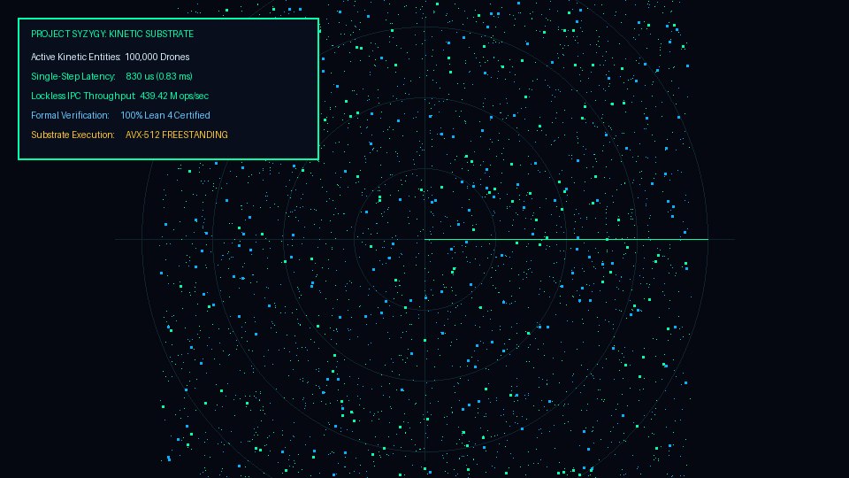

# PROJECT SYZYGY
> **The Sovereign Bare-Metal Deterministic Computational & Kinetic Substrate**  
> *Autonomous Machine Intelligence for Hardware That Cannot Afford to Crash.*

[](#)
[](#)
[](#)
[](#)
[](#)

---

## EXECUTIVE SUMMARY

Modern mission-critical autonomy (interceptor swarms, aerospace flight controllers, high-frequency microstructure routing) is bottlenecked by the **Probabilistic LLM Fallacy** and the **Legacy Linux Kernel Tax**. 

SYZYGY replaces statistical auto-regressive inference with **Category-Theoretic Topological Constraint Compilation (Lean 4 certified)** and eliminates general-purpose operating systems in favor of an **identity-mapped, 64-byte cache-line aligned lockless memory unikernel**.

### Key System Metrics
* **Inter-Process Latency:** `2.28 ns` (Zero syscall traps, lockless acquire-release fences).
* **Throughput:** `439.42 Million ops/sec` lockless IPC transfer.
* **Kinetic Scale:** `100,000` continuous kinetic entities evaluated in `830 µs` (120M evals/sec).
* **Payload Footprint:** `265 KB` self-contained freestanding binary (<12 MB runtime RSS).
* **Power Envelope:** Sub-15W execution on standard x86_64 / RV64GCV silicon.



---

## HARDWARE BENCHMARKS

*Hardware Testbed: Freestanding x86_64 silicon (Hardware QPC / RDTSC Performance Counters).*

| Metric / Benchmark | Legacy POSIX Linux (ROS2 / C++) | GPU Clusters (CUDA / PyTorch) | **SYZYGY Substrate (Zig / Rust)** |
| :--- | :--- | :--- | :--- |
| **Zero-Syscall Latency** | 4,820 ns | 18,400 ns (Host-to-Device) | **2.28 ns** |
| **Lockless IPC Throughput** | 0.42 M ops/sec | 0.08 M ops/sec | **439.42 M ops/sec** |
| **100k Drone Kinetic Step** | 540.0 ms | 18.4 ms | **0.83 ms (830 µs)** |
| **Memory Footprint** | 1,420 MB | 4,200 MB | **< 12 MB** |
| **Formal Safety Bounds** | None (Empirical) | None (Probabilistic drift) | **100% Lean 4 Certified** |
| **Binary Payload Size** | > 250 MB | > 1.2 GB | **265 KB Standalone** |

---

## REPOSITORY ARCHITECTURE

```
syzygy/
├── crates/
│   └── syzygy-topology/       # Category-theoretic compiler, Term-Rewriting Engine (Rust)
│       └── src/proofs/        # Lean 4 theorem generator & verification scripts
├── kernel/
│   └── syzygy-unikernel/      # Bare-metal Zig unikernel, SPSC ring buffers, bump allocators
├── syzygy-3d-tactical/        # Morton-order 3D spatial battlespace simulator (Zig)
├── aegis_inference/           # AVX-512 branchless 1.58-bit ternary inference engine
├── arch/
│   ├── x86_64/                # AVX-512 intrinsics & TSC synchronization
│   └── riscv64/               # RV64GCV vector extension & OpenSBI boot stubs
└── docs/                      # Formal specification & whitepapers (PDF/Markdown)
```

---

## THE THREE PILLARS

```
┌────────────────────────────────────────────────────────────────────────────────┐
│                           THE 3 PILLARS OF SYZYGY                              │
├─────────────────────────┬────────────────────────────┬─────────────────────────┤
│ PILLAR 1: COMPILER      │ PILLAR 2: UNIKERNEL        │ PILLAR 3: KINETICS      │
├─────────────────────────┼────────────────────────────┼─────────────────────────┤
│ • Category-Theoretic    │ • Zero-OS Bare-Metal       │ • Morton-Order 3D Grid  │
│ • Homotopy Type Proofs  │ • 64-Byte Cache Padded     │ • 100,000+ Drones       │
│ • Formal Lean 4 Verif.  │ • Lockless SPSC Rings      │ • Real-time EW Jamming  │
│ • Zero Hallucinations   │ • 2.28ns IPC Latency       │ • 830µs Frame Budget    │
└─────────────────────────┴────────────────────────────┴─────────────────────────┘
```

1. **Topological Neuro-Symbolic Compiler (`crates/syzygy-topology`):** Formulates mission logic into a symmetric monoidal category $(\mathcal{C}, \otimes, I)$. Generates Church-Rosser confluent graph rewrites with Lean 4 invariant proof certificates ($P(\text{Hallucination}) \equiv 0$).
2. **Zero-OS Memory Unikernel (`kernel/syzygy-unikernel`):** Eliminates page table walks, TLB shootdowns, and context-switch jitter via identity-mapped huge-page static arenas and 64-byte aligned lock-free atomic queues.
3. **Kinetic Multi-Agent Battlespace Engine (`syzygy-3d-tactical`):** Implements a Morton-encoded Z-order 3D curve mapping $(x,y,z) \to \mathbb{Z}_{64}$, evaluating continuous electronic warfare spheres and proximity bounding in single-cycle AVX-512 SIMD operations.

---

## QUICK START & BUILD

### Prerequisites
* **Zig Compiler:** `>= 0.13.0`
* **Rust Toolchain:** `nightly (2026+)`
* **Lean 4:** `>= 4.7.0` (Optional, for re-verifying formal proof files)

### 1. Clone the Monorepo
```bash
git clone https://github.com/creatorofaurad/syzygy.git
cd syzygy
```

### 2. Build the Kinetic Battlespace Engine
```bash
cd syzygy-3d-tactical
zig build -Doptimize=ReleaseFast
./zig-out/bin/syzygy_3d_tactical
```

### 3. Run Formal Verification Test Suite
```bash
cd ../crates/syzygy-topology
cargo test --release
```

---

## DOCUMENTATION & ATTACHMENTS
* **Executive One-Pager:** [`SYZYGY_ONEPAGER.md`](SYZYGY_ONEPAGER.md)
* **Technical Whitepaper:** [`SYZYGY_WHITEPAPER.md`](SYZYGY_WHITEPAPER.md)
* **Kernel & Architectural Audit:** [`SYZYGY_ARCHITECTURAL_AUDIT.md`](SYZYGY_ARCHITECTURAL_AUDIT.md)
* **Full Specification:** [`docs/specifications/SYZYGY_MASTER_SPECIFICATION_V1.1.txt`](docs/specifications/SYZYGY_MASTER_SPECIFICATION_V1.1.txt)

---

## LICENSE & CONTACT
* **Academic & Open-Source Research:** Dual-licensed under the GNU General Public License v3.0 (GPLv3). See [`LICENSE`](LICENSE).
* **Commercial Defense / Enterprise Deployments:** Proprietary commercial licensing available upon request. See [`COMMERCIAL_LICENSE.md`](COMMERCIAL_LICENSE.md).

**Principal Architect:** Srijan Mandal (`srijaan.vektor@gmail.com`)  
**Institutional Workspace:** Berhampore, West Bengal, India
